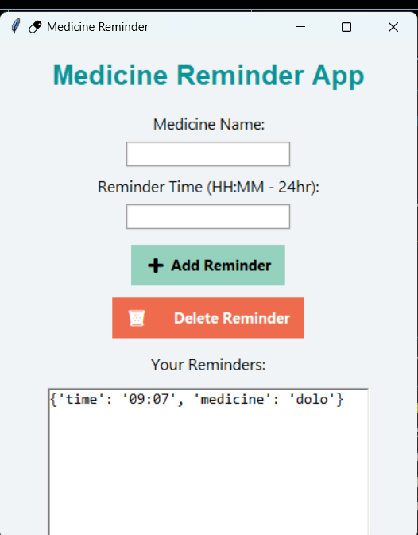

# Medicine Reminder App 💊

A simple Python-based desktop application that helps users set and manage medicine reminders using a graphical user interface (GUI) built with Tkinter.

## 🛠 Features
- Add new medicine reminders
- Remove reminders
- GUI interface for easy use
- Alert window for medicine reminders

## 🚀 Technologies Used
- Python
- Tkinter

## 📸 Screenshot

> Make sure this image is uploaded in the repository root with the name `screenshot.png`.

## 📁 File Description
- `main.py` – Core Python file that runs the app

## 🙋‍♀️ Author
Sindhoora Rai K  
[LinkedIn](https://www.linkedin.com/in/sindhoora-rai-k-2940a9306/)

## 🔖 License
This project is licensed under the MIT License.
